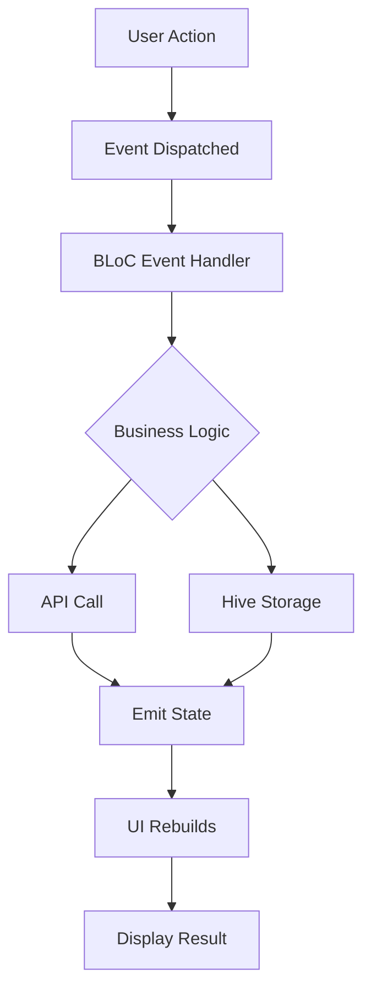

## Overview

Aradia Audiobooks uses a **hybrid state management approach** combining:

- **BLoC (Business Logic Component)** for screen-specific business logic
- **Provider** for global application state and services
- **Hive** for persistent local storage

This combination provides the right tool for each use case, ensuring maintainable and scalable code.

## State Management Strategy

<CardGroup cols={3}>
  <Card title="BLoC" icon="cubes">
    Screen-specific business logic with reactive streams
  </Card>
  <Card title="Provider" icon="arrows-down-to-people">
    Global services and shared state across widgets
  </Card>
  <Card title="Hive" icon="database">
    Persistent storage for offline data
  </Card>
</CardGroup>

## BLoC Pattern

### When to Use BLoC

Use BLoC for:
- Screen-specific business logic
- Complex state transitions
- Asynchronous operations (API calls)
- Pagination and data fetching
- Search functionality

### BLoC Architecture

Each BLoC consists of three parts:

1. **Events** - User actions or external triggers
2. **States** - UI states representing different conditions
3. **BLoC** - Business logic that transforms events into states

### Search BLoC Example

Here's how the Search feature is implemented:

<CodeGroup>
```dart lib/screens/search/bloc/search_bloc.dart
import 'dart:async';
import 'package:bloc/bloc.dart';
import 'package:aradia/resources/archive_api.dart';
import 'package:aradia/resources/models/audiobook.dart';
import 'package:aradia/utils/app_events.dart';
import 'package:meta/meta.dart';

part 'search_event.dart';
part 'search_state.dart';

class SearchBloc extends Bloc<SearchEvent, SearchState> {
  int currentPage = 1;
  
  /// The last query that was explicitly submitted
  String? lastQuery;
  
  StreamSubscription<void>? _langSub;

  SearchBloc() : super(SearchInitial()) {
    on<EventSearchIconClicked>(_onSearchSubmitted);
    on<EventLoadMoreResults>(_onLoadMore);

    // Refresh results for current query on language change
    _langSub = AppEvents.languagesChanged.stream.listen((_) {
      final q = lastQuery?.trim();
      if (q != null && q.isNotEmpty) {
        add(EventSearchIconClicked(q));
      }
    });
  }

  Future<void> _onSearchSubmitted(
    EventSearchIconClicked event,
    Emitter<SearchState> emit,
  ) async {
    // New search starts at page 1 and locks in the query
    currentPage = 1;
    lastQuery = event.searchQuery;
    
    await _runSearch(
      emit, 
      query: lastQuery!, 
      page: currentPage, 
      isFresh: true
    );
  }

  Future<void> _onLoadMore(
    EventLoadMoreResults event,
    Emitter<SearchState> emit,
  ) async {
    // Keep using the locked-in lastQuery
    final q = lastQuery?.trim();
    if (q == null || q.isEmpty) return;

    currentPage += 1;
    await _runSearch(emit, query: q, page: currentPage, isFresh: false);
  }

  Future<void> _runSearch(
    Emitter<SearchState> emit, {
    required String query,
    required int page,
    required bool isFresh,
  }) async {
    if (isFresh) {
      emit(SearchLoading());
    }

    try {
      final res = await ArchiveApi().searchAudiobook(query, page, 10);

      res.fold(
        (err) {
          if (isFresh) {
            emit(SearchFailure(err));
          }
        },
        (list) {
          if (isFresh) {
            emit(SearchSuccess(list));
          } else {
            // Append to existing list
            final prev = state;
            if (prev is SearchSuccess) {
              emit(SearchSuccess([...prev.audiobooks, ...list]));
            } else {
              emit(SearchSuccess(list));
            }
          }
        },
      );
    } catch (_) {
      if (isFresh) {
        emit(SearchFailure('Failed to search audiobooks'));
      }
    }
  }

  @override
  Future<void> close() {
    _langSub?.cancel();
    return super.close();
  }
}
```

```dart lib/screens/search/bloc/search_event.dart
part of 'search_bloc.dart';

@immutable
sealed class SearchEvent {}

class EventSearchIconClicked extends SearchEvent {
  final String searchQuery;
  EventSearchIconClicked(this.searchQuery);
}

class EventLoadMoreResults extends SearchEvent {
  final String searchQuery;
  EventLoadMoreResults(this.searchQuery);
}
```

```dart lib/screens/search/bloc/search_state.dart
part of 'search_bloc.dart';

@immutable
sealed class SearchState {}

final class SearchInitial extends SearchState {}

class SearchLoading extends SearchState {}

class SearchSuccess extends SearchState {
  final List<Audiobook> audiobooks;
  SearchSuccess(this.audiobooks);
}

class SearchFailure extends SearchState {
  final String errorMessage;
  SearchFailure(this.errorMessage);
}
```
</CodeGroup>

### Home BLoC Example

The Home screen demonstrates multiple event handlers and state management:

<CodeGroup>
```dart lib/screens/home/bloc/home_bloc.dart
class HomeBloc extends Bloc<HomeEvent, HomeState> {
  final ArchiveApi _archiveApi;
  StreamSubscription<void>? _langSub;
  int _reqGen = 0; // Generation token to cancel stale requests

  HomeBloc({ArchiveApi? archiveApi})
      : _archiveApi = archiveApi ?? ArchiveApi(),
        super(HomeInitial()) {
    on<FetchLatestAudiobooks>(_onFetchLatestAudiobooks);
    on<FetchPopularAudiobooks>(_onFetchPopularAudiobooks);
    on<FetchPopularThisWeekAudiobooks>(_onFetchPopularThisWeekAudiobooks);
    on<FetchAudiobooksByGenre>(_onFetchAudiobooksByGenre);

    on<ResetHomeLists>((event, emit) {
      // Bump generation so in-flight old requests are ignored
      _reqGen++;
      emit(HomeInitial());
      add(FetchLatestAudiobooks(1, 20));
      add(FetchPopularAudiobooks(1, 20));
      add(FetchPopularThisWeekAudiobooks(1, 20));
    });

    // Listen for language changes and refresh data
    _langSub = AppEvents.languagesChanged.stream.listen((_) {
      add(ResetHomeLists());
    });
  }

  Future<void> _fetchAudiobooks({
    required int page,
    required int rows,
    required Future<Either<String, List<Audiobook>>> Function() fetchFunction,
    required HomeState loadingState,
    required HomeState Function(List<Audiobook>) successState,
    required HomeState failureState,
    required Emitter<HomeState> emit,
  }) async {
    // Capture the generation at the time this request starts
    final localGen = _reqGen;

    if (page == 1) {
      emit(loadingState);
    }

    try {
      final result = await fetchFunction();

      // If language changed while in-flight, drop it silently
      if (localGen != _reqGen) return;

      result.fold(
        (_) {
          if (page == 1) {
            emit(failureState);
          }
        },
        (audiobooks) => emit(successState(audiobooks)),
      );
    } catch (_) {
      if (localGen != _reqGen) return;
      if (page == 1) {
        emit(failureState);
      }
    }
  }

  @override
  Future<void> close() {
    _langSub?.cancel();
    return super.close();
  }
}
```
</CodeGroup>

### Using BLoC in Widgets

Providing and consuming BLoC in the widget tree:

<CodeGroup>
```dart Providing BLoC
class MyApp extends StatelessWidget {
  @override
  Widget build(BuildContext context) {
    return MultiBlocProvider(
      providers: [
        BlocProvider(
          create: (context) => AudiobookDetailsBloc(),
        ),
        BlocProvider(
          create: (context) => SearchBloc(),
        ),
      ],
      child: MaterialApp.router(
        routerConfig: router,
      ),
    );
  }
}
```

```dart Consuming BLoC
class SearchAudiobook extends StatelessWidget {
  @override
  Widget build(BuildContext context) {
    return BlocBuilder<SearchBloc, SearchState>(
      builder: (context, state) {
        if (state is SearchLoading) {
          return CircularProgressIndicator();
        } else if (state is SearchSuccess) {
          return ListView.builder(
            itemCount: state.audiobooks.length,
            itemBuilder: (context, index) {
              return AudiobookCard(state.audiobooks[index]);
            },
          );
        } else if (state is SearchFailure) {
          return Text('Error: ${state.errorMessage}');
        }
        return SearchInitialView();
      },
    );
  }
}
```

```dart Dispatching Events
// In a widget
IconButton(
  icon: Icon(Icons.search),
  onPressed: () {
    context.read<SearchBloc>().add(
      EventSearchIconClicked(searchController.text)
    );
  },
)

// Load more on scroll
scrollController.addListener(() {
  if (scrollController.position.pixels == 
      scrollController.position.maxScrollExtent) {
    context.read<SearchBloc>().add(
      EventLoadMoreResults(currentQuery)
    );
  }
});
```
</CodeGroup>

## Provider Pattern

### When to Use Provider

Use Provider for:
- Global services (audio player, theme, settings)
- Shared state across multiple screens
- Dependency injection
- Simple state that doesn't require complex logic

### Global Providers

Aradia uses several global providers:

<CodeGroup>
```dart lib/main.dart
void main() async {
  WidgetsFlutterBinding.ensureInitialized();
  
  await initHive();
  await AppLogger.initialize();
  
  final chromeCastService = ChromeCastService();
  await chromeCastService.initialize();
  
  final audioHandlerProvider = AudioHandlerProvider();
  final weSlideController = WeSlideController();
  final themeNotifier = ThemeNotifier();
  final youtubeAudiobookNotifier = YoutubeAudiobookNotifier();
  final webViewKeepAliveProvider = WebViewKeepAliveProvider();
  
  runApp(
    MultiProvider(
      providers: [
        ChangeNotifierProvider(create: (_) => audioHandlerProvider),
        ChangeNotifierProvider(create: (_) => weSlideController),
        ChangeNotifierProvider(create: (_) => themeNotifier),
        ChangeNotifierProvider(create: (_) => youtubeAudiobookNotifier),
        ChangeNotifierProvider(create: (_) => webViewKeepAliveProvider),
      ],
      child: const MyApp(),
    ),
  );
  
  // Initialize audio handler after first frame
  WidgetsBinding.instance.addPostFrameCallback((_) {
    audioHandlerProvider.initialize();
  });
}
```
</CodeGroup>

### Audio Handler Provider

Manages the audio service for background playback:

<CodeGroup>
```dart lib/resources/services/audio_handler_provider.dart
import 'package:aradia/resources/services/my_audio_handler.dart';
import 'package:flutter/material.dart';
import 'package:audio_service/audio_service.dart';

class AudioHandlerProvider extends ChangeNotifier {
  late MyAudioHandler _audioHandler = MyAudioHandler();

  Future<void> initialize() async {
    _audioHandler = await AudioService.init(
      builder: () => MyAudioHandler(),
      config: const AudioServiceConfig(
        androidNotificationChannelId: 'com.oseamiya.librivoxaudiobook',
        androidNotificationChannelName: 'Audio playback',
        androidNotificationOngoing: true,
      ),
    );
    notifyListeners(); // Notify listeners that initialization is done
  }

  MyAudioHandler get audioHandler => _audioHandler;
}
```

```dart Using Audio Handler
class PlayerControls extends StatelessWidget {
  @override
  Widget build(BuildContext context) {
    final audioHandler = context.watch<AudioHandlerProvider>().audioHandler;
    
    return IconButton(
      icon: Icon(Icons.play_arrow),
      onPressed: () {
        audioHandler.play();
      },
    );
  }
}
```
</CodeGroup>

### Theme Notifier

Manages app theme with persistent storage:

<CodeGroup>
```dart lib/resources/designs/theme_notifier.dart
import 'package:flutter/material.dart';
import 'package:hive/hive.dart';

class ThemeNotifier extends ChangeNotifier {
  // Default to system theme
  ThemeMode _themeMode = ThemeMode.system;
  ThemeMode get themeMode => _themeMode;
  
  final Box<dynamic> _themeBox = Hive.box('theme_mode_box');
  
  ThemeNotifier() {
    _loadTheme();
  }
  
  void _loadTheme() {
    // Store one of: 'system' | 'light' | 'dark'
    final saved = _themeBox.get(
      'theme_mode_box', 
      defaultValue: 'system'
    ) as String;
    
    switch (saved) {
      case 'light':
        _themeMode = ThemeMode.light;
        break;
      case 'dark':
        _themeMode = ThemeMode.dark;
        break;
      default:
        _themeMode = ThemeMode.system;
    }
    notifyListeners();
  }
  
  void setTheme(ThemeMode mode) {
    _themeMode = mode;
    final value = switch (mode) {
      ThemeMode.light => 'light',
      ThemeMode.dark => 'dark',
      _ => 'system',
    };
    _themeBox.put('theme_mode_box', value);
    notifyListeners();
  }
  
  void toggleTheme() {
    if (_themeMode == ThemeMode.light) {
      _themeMode = ThemeMode.dark;
    } else {
      _themeMode = ThemeMode.light;
    }
    _themeBox.put(
      'theme_mode_box',
      _themeMode == ThemeMode.dark ? 'dark' : 'light',
    );
    notifyListeners();
  }
}
```

```dart Using Theme
class MyApp extends StatelessWidget {
  @override
  Widget build(BuildContext context) {
    return Consumer<ThemeNotifier>(
      builder: (context, themeNotifier, _) {
        return MaterialApp.router(
          theme: Themes.lightTheme,
          darkTheme: Themes.darkTheme,
          themeMode: themeNotifier.themeMode,
          routerConfig: router,
        );
      },
    );
  }
}

// Toggle theme in settings
IconButton(
  icon: Icon(Icons.brightness_6),
  onPressed: () {
    context.read<ThemeNotifier>().toggleTheme();
  },
)
```
</CodeGroup>

## Hive Storage

### Initialization

Hive boxes are initialized at app startup:

```dart lib/main.dart
Future<void> initHive() async {
  final documentDir = await getApplicationDocumentsDirectory();
  await Hive.initFlutter(documentDir.path);
  
  await Hive.openBox('favourite_audiobooks_box');
  await Hive.openBox('download_status_box');
  await Hive.openBox('playing_audiobook_details_box');
  await Hive.openBox('theme_mode_box');
  await Hive.openBox('history_of_audiobook_box');
  await Hive.openBox('recommened_audiobooks_box');
  await Hive.openBox('dual_mode_box');
  await Hive.openBox('language_prefs_box');
  
  Box recommendedAudiobooksBox = Hive.box('recommened_audiobooks_box');
  isRecommendScreen = recommendedAudiobooksBox.isEmpty ? 1 : 0;
}
```

### Using Hive

<CodeGroup>
```dart Writing to Hive
// Get box
final box = Hive.box('favourite_audiobooks_box');

// Save audiobook
final audiobookMap = audiobook.toMap();
box.put(audiobook.id, audiobookMap);

// Save simple value
box.put('last_played_id', 'audiobook_123');
```

```dart Reading from Hive
// Get box
final box = Hive.box('favourite_audiobooks_box');

// Read audiobook
final audiobookMap = box.get('audiobook_123');
if (audiobookMap != null) {
  final audiobook = Audiobook.fromMap(audiobookMap);
}

// Check if exists
if (box.containsKey('audiobook_123')) {
  // Audiobook is in favorites
}

// Get all values
final allFavorites = box.values.map(
  (map) => Audiobook.fromMap(map)
).toList();
```

```dart Watching Hive Changes
class FavoritesWidget extends StatefulWidget {
  @override
  State<FavoritesWidget> createState() => _FavoritesWidgetState();
}

class _FavoritesWidgetState extends State<FavoritesWidget> {
  late Box box;
  late Stream<BoxEvent> boxStream;
  
  @override
  void initState() {
    super.initState();
    box = Hive.box('favourite_audiobooks_box');
    boxStream = box.watch();
  }
  
  @override
  Widget build(BuildContext context) {
    return StreamBuilder<BoxEvent>(
      stream: boxStream,
      builder: (context, snapshot) {
        final favorites = box.values.map(
          (map) => Audiobook.fromMap(map)
        ).toList();
        
        return ListView.builder(
          itemCount: favorites.length,
          itemBuilder: (context, index) {
            return AudiobookCard(favorites[index]);
          },
        );
      },
    );
  }
}
```

```dart Deleting from Hive
// Delete single entry
box.delete('audiobook_123');

// Clear all
box.clear();

// Delete multiple
box.deleteAll(['audiobook_1', 'audiobook_2']);
```
</CodeGroup>

## Best Practices

<AccordionGroup>
  <Accordion title="BLoC Best Practices">
    1. **One BLoC per screen** - Keep BLoCs focused on a single responsibility
    2. **Clean up subscriptions** - Always cancel StreamSubscriptions in `close()`
    3. **Immutable events and states** - Use `@immutable` and final fields
    4. **Sealed classes** - Use sealed classes for events and states in Dart 3.0+
    5. **Handle all states** - Ensure UI handles all possible states
    6. **Avoid business logic in UI** - Keep widgets focused on presentation
  </Accordion>

  <Accordion title="Provider Best Practices">
    1. **Dispose resources** - Override `dispose()` to clean up
    2. **Minimize rebuilds** - Use `Consumer` or `Selector` instead of `context.watch()`
    3. **Use `context.read()` for actions** - Don't use `context.watch()` for one-time actions
    4. **Lazy initialization** - Use `lazy: true` for providers not needed at startup
    5. **Combine with BLoC** - Use Provider for services, BLoC for business logic
  </Accordion>

  <Accordion title="Hive Best Practices">
    1. **Initialize early** - Open boxes before `runApp()`
    2. **Use descriptive names** - Name boxes clearly (e.g., `favourite_audiobooks_box`)
    3. **Type safety** - Use `Box<T>` with typed models when possible
    4. **Compact regularly** - Call `box.compact()` to optimize storage
    5. **Avoid large objects** - Store only necessary data
    6. **Use adapters for complex types** - Register custom type adapters
  </Accordion>
</AccordionGroup>

## State Flow Diagram



## Testing State Management

<CodeGroup>
```dart BLoC Testing
import 'package:bloc_test/bloc_test.dart';
import 'package:flutter_test/flutter_test.dart';

void main() {
  group('SearchBloc', () {
    late SearchBloc searchBloc;
    
    setUp(() {
      searchBloc = SearchBloc();
    });
    
    tearDown(() {
      searchBloc.close();
    });
    
    test('initial state is SearchInitial', () {
      expect(searchBloc.state, SearchInitial());
    });
    
    blocTest<SearchBloc, SearchState>(
      'emits [SearchLoading, SearchSuccess] when search is successful',
      build: () => searchBloc,
      act: (bloc) => bloc.add(EventSearchIconClicked('flutter')),
      expect: () => [
        SearchLoading(),
        isA<SearchSuccess>(),
      ],
    );
  });
}
```

```dart Provider Testing
import 'package:flutter_test/flutter_test.dart';

void main() {
  test('ThemeNotifier toggles theme', () {
    final themeNotifier = ThemeNotifier();
    final initialMode = themeNotifier.themeMode;
    
    themeNotifier.toggleTheme();
    
    expect(themeNotifier.themeMode, isNot(initialMode));
  });
}
```
</CodeGroup>

## Common Patterns

### Pagination with BLoC

```dart
class PaginationBloc extends Bloc<PaginationEvent, PaginationState> {
  int currentPage = 1;
  bool hasMore = true;
  
  PaginationBloc() : super(PaginationInitial()) {
    on<LoadMore>(_onLoadMore);
  }
  
  Future<void> _onLoadMore(
    LoadMore event,
    Emitter<PaginationState> emit,
  ) async {
    if (!hasMore) return;
    
    final currentState = state;
    
    if (currentState is PaginationSuccess) {
      final newItems = await fetchPage(currentPage + 1);
      currentPage++;
      hasMore = newItems.isNotEmpty;
      
      emit(PaginationSuccess(
        items: [...currentState.items, ...newItems],
        hasMore: hasMore,
      ));
    }
  }
}
```

### Error Handling

```dart
try {
  final result = await apiCall();
  result.fold(
    (error) => emit(ErrorState(error)),
    (data) => emit(SuccessState(data)),
  );
} catch (e) {
  emit(ErrorState(e.toString()));
}
```

## Next Steps

<CardGroup cols={2}>
  <Card title="Architecture" icon="sitemap" href="/development/architecture">
    Learn about the overall app architecture
  </Card>
  <Card title="Building from Source" icon="hammer" href="/development/building-from-source">
    Set up your development environment
  </Card>
  <Card title="Contributing" icon="code-pull-request" href="/development/contributing">
    Start contributing to the project
  </Card>
</CardGroup>